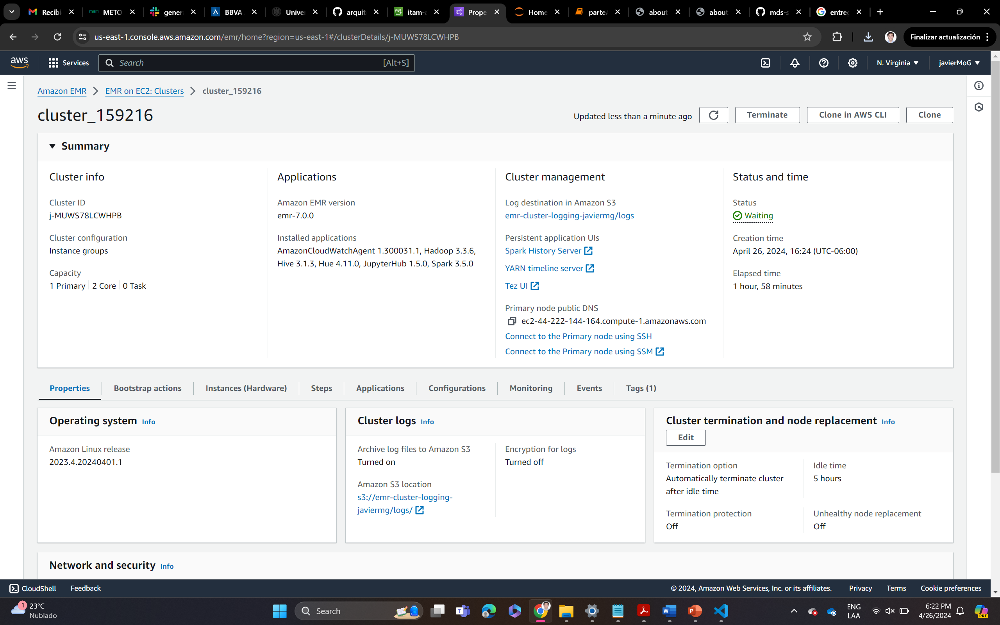

# Quién es quién en los precios Database and Data Engineering 

## Collaborators
Team 1:

Name | ID | Email
--- | --- | ---
Pablo Martínez | 165680 | pmarti44@itam.mx
Javier Montiel | 159216 | jmontie3@itam.mx
Román Vélez | 165462 | roman.velez@itam.mx

## Objective 

- Use Quién es Quién en los precios dataset to practice the technology tools learned in the data architecture class of the MDS'24

## Data

- The data used in this project is from  [Quiés es quién en los precios Dataset](https://datos.profeco.gob.mx/datos_abiertos/qqp.php)
- The years analyzed are from 2018 to 2024
- The category asigned was `medicamentos` for certain questions of the project

## Repository structure

- [figures](!https://github.com/romanAVJ/mds-spark-project/tree/main/src): Screenshots of the deliverables.

- [src](!https://github.com/romanAVJ/mds-spark-project/tree/main/src): The code used for the project.

    - [s1_clean](!https://github.com/romanAVJ/mds-spark-project/tree/main/src/s1_clean): Here it is included the bash code used to clean the data.
    
    - [s2_spark](!https://github.com/romanAVJ/mds-spark-project/tree/main/src/s2_spark): Here it is included the notebooks of the part A and part B of the project. Part A has 2 notebooks: `partA.ipynb` where the pyspark queries were fetched and `TimeSeriesPlot.R` where it was made a time series plot of the last questions of part A.

- **requirements.txt**: The libraries used in the project.

- **config.yaml**: The configuration file used in the project.

## Technology used in current scenario
-  `Bash`: Bash was used to clean the data and create a unified dataset

- `PySpark`: PySpark was used in a AWS cluster environment, as the unified dataset size is 25.2 GB.

- `Python`: Python was used to connect to Athena in order to do queries. :snake:

- `R`: R was used to make a time series plot by frames for the part A of the project.

## Deliverables

### P1: S3 Screanshot

### P2: Cluster Dashboard

### P3: JupyterHub

### P4: Athena Tables

